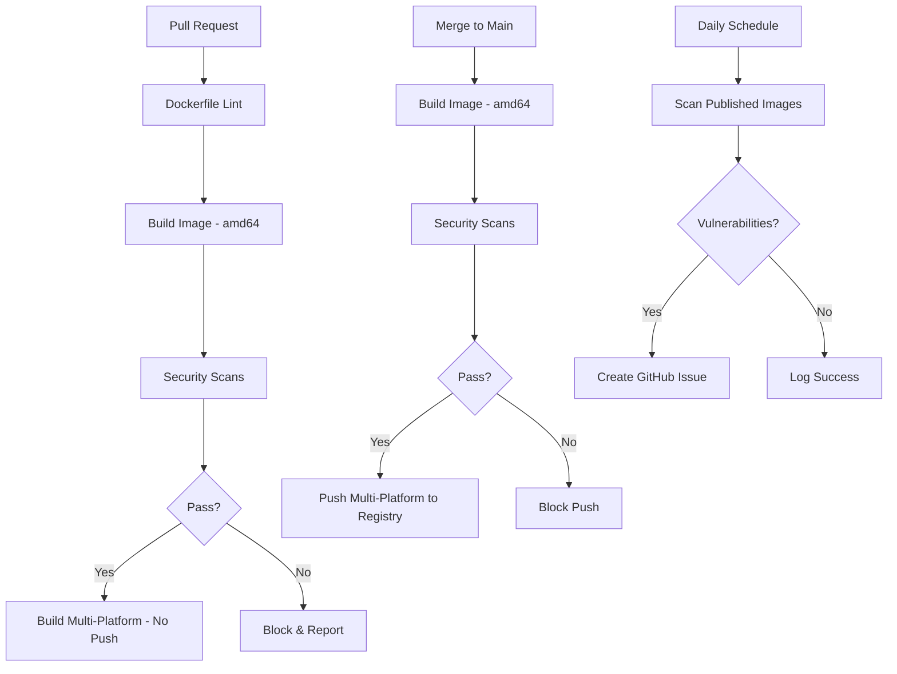

# Security Scanning Architecture

## Overview

Our security scanning is fully integrated into the build pipeline, ensuring comprehensive vulnerability detection before images are published, with continuous monitoring of deployed images.

## Scanning Workflows

### 1. Build & Security Pipeline (build-images.yml)

**When:**
- Pull requests to main branch
- Push to main branch
- Manual workflow dispatch

**Security Steps:**

**Pull Requests:**
1. **Dockerfile Linting** - Hadolint checks for best practices
2. **Image Build** - Single platform (amd64) for scanning
3. **Vulnerability Scanning** - Trivy and Grype scanners
4. **SBOM Generation** - Syft creates SPDX format
5. **Security Gates** - Block if vulnerabilities found
6. **Multi-platform Build** - Build only, no push

**Main Branch:**
1. **Image Build** - Single platform (amd64) for scanning
2. **Vulnerability Scanning** - Trivy and Grype scanners
3. **SBOM Generation** - Syft creates SPDX format
4. **Security Gates** - Block push if CRITICAL/HIGH vulnerabilities
5. **Multi-platform Push** - Only after all checks pass

```yaml
PR:   Dockerfile Lint → Build (amd64) → Security Scans → Pass? → Build Multi-Platform (no push)
Main: Build (amd64) → Security Scans → Pass? → Push Multi-Platform
                                         ↓
                                        Fail → Block & Report
```

**Scanners Integrated:**
- **Hadolint**: Dockerfile best practices and security
- **Trivy**: Comprehensive vulnerability scanning (OS, libraries)
- **Grype**: Additional vulnerability detection with Anchore DB
- **Syft**: Software Bill of Materials generation

### 2. Daily Security Monitoring (daily-security-scan.yml)

**When:** Daily at 2 AM UTC or manual trigger
**What:** Re-scan all published images for new vulnerabilities
**Action:** Create GitHub issues for CRITICAL/HIGH vulnerabilities

## Workflow Integration



## Security Gates

### Build Pipeline Gates

1. **Dockerfile Linting**: Hadolint checks during build
2. **Pre-Push Scan**: Trivy blocks HIGH/CRITICAL before registry push
3. **SARIF Upload**: All results to GitHub Security tab

### Pull Request Gates

- Security scan results posted as PR comments
- SARIF results visible in Security tab
- Build blocked if critical vulnerabilities found

### Production Gates

- Only images passing all scans reach Docker Hub
- Daily monitoring for new vulnerabilities
- Automated SBOM generation for compliance

## Configuration

### Severity Thresholds

- **Block Build**: CRITICAL, HIGH
- **Warning**: MEDIUM
- **Info Only**: LOW, UNKNOWN

### Scanner Settings

**Trivy (Pre-Push)**

```yaml
severity: CRITICAL,HIGH
exit-code: 1  # Fail on findings
format: sarif
```

**Trivy (Comprehensive)**

```yaml
severity: CRITICAL,HIGH,MEDIUM,LOW
vuln-type: os,library,secret,config
format: sarif,json,table
```

**Hadolint**

```yaml
ignore:
  - DL3008  # apt-get version pinning
  - DL3009  # apt-get lists deletion
format: sarif
```

## SBOM Generation

Each image build generates:
- SPDX JSON format SBOM
- CycloneDX JSON format SBOM
- 30-day artifact retention
- Future: Attestation signing with Cosign

## Reporting

### GitHub Integration

- SARIF results in Security tab
- PR comments with scan summaries
- Workflow artifacts for detailed reports

### Monitoring

- Daily vulnerability scans
- Security badge updates

## Manual Scanning

### Scan Specific Image

```bash
# Trigger workflow manually
gh workflow run security-scan.yml -f image=titaniumlabs/alpine:3.22.1
```

### Local Scanning

```bash
# Using Trivy locally
trivy image titaniumlabs/alpine:3.22.1

# Using Grype locally
grype titaniumlabs/alpine:3.22.1

# Generate SBOM locally
syft titaniumlabs/alpine:3.22.1 -o spdx-json
```

## Security Exceptions

Managed in `.github/security-policy.yml`:
- Accepted vulnerabilities with justification
- Expiration dates for exceptions
- Allowed packages despite vulnerabilities

## Future Enhancements

- [ ] Cosign signing for images
- [ ] In-toto attestations
- [ ] Automated issue creation for vulnerabilities
- [ ] Slack/email notifications
- [ ] Dependency update automation
- [ ] Security scorecard integration
